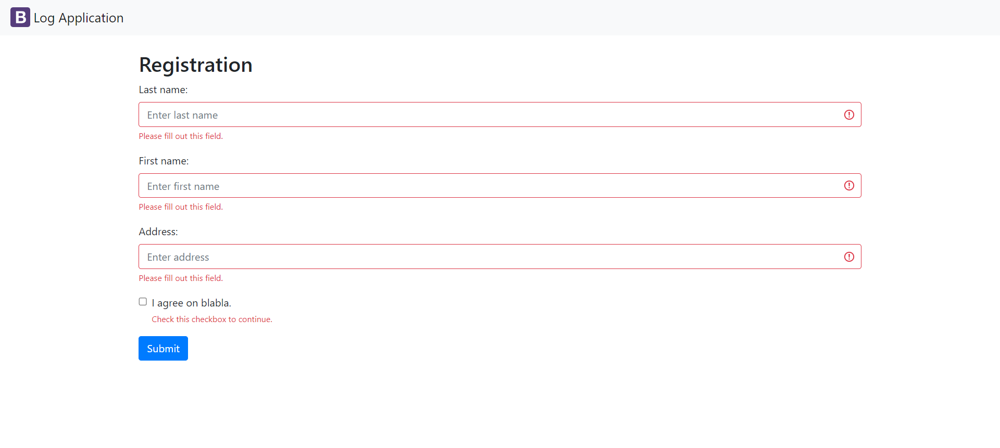
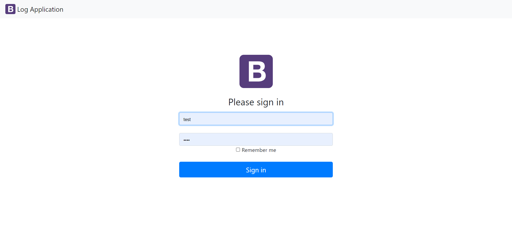
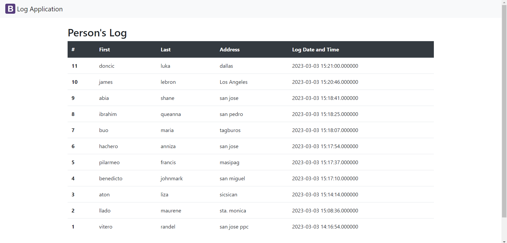
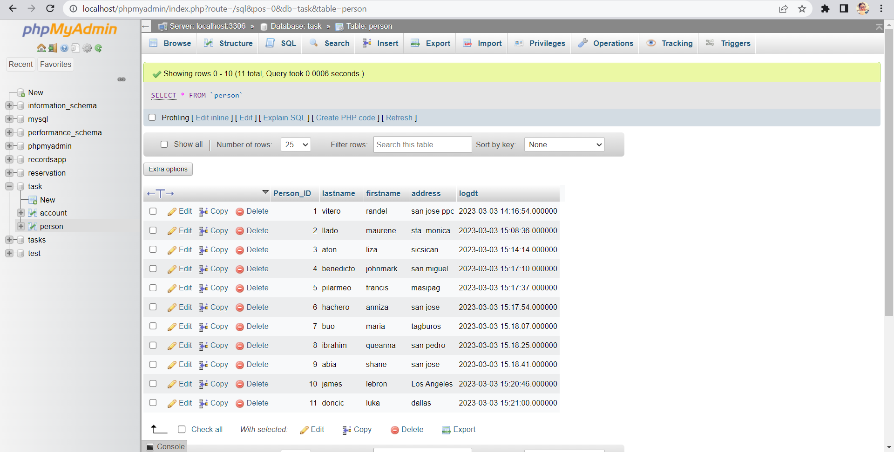

# WEEK 10, PRACTICE SETS 10

**NAME**
### Name: LOG APP
<br>

**DESCRIPTION**

The **THE LOG APP** is a system Application that can collect, store and manage data logs from the users input information, Also the purpose of this app is to monitor user's information and also to protect the information that stored in a system. **Application Development and Emerging Technologies 1 (CC 6/L)**. :innocent:

<br>

**VISUAL**

<br>



<br>



<br>



<br>

**INSTALLATION**

1. Download and install XAMPP on your computer. 

<br>

2. Create the server and database for the LOG APP using phpMyAdmin.

<br>



<br>

3. ### Set-up the Database:
```
<?php
	define('ROOT_URL', 'http://localhost/logApp-scaling-octo/index.php');
	define('DB_HOST', 'localhost');
	define('DB_USER', 'root');
	define('DB_PASS', '');
	define('DB_NAME', 'task);
	?>
```
4. ### Establish a Connection:
```
<?php
	// Create Connection
	$conn = mysqli_connect(DB_HOST, DB_USER, DB_PASS, DB_NAME);

	// Check Connection
	if(mysqli_connect_errno()){
		// Connection Failed
		echo 'Failed to connect to MySQL '. mysqli_connect_errno();
	}
	?>
```
5. ### Use require method to Insert connection:
```
require('config/config.php');
require('config/db.php');
```
6. ### Start the Application:
```
Start with your html and css with the following step above
```

**AUTHORS**

**Facebook:** [**Johnmark Benedicto**](https://www.facebook.com/Johnmark.Benedicto.11)<br>
**GitHub:** [**Bennyskiee**](https://github.com/Bennyskiee)
<br> 

<br>

**Facebook:** [**Liza May Aton**](https://www.facebook.com/liza.asutilla.aton.07100504)<br>
**GitHub:** [**whisky05040710**](https://github.com/whisky05040710)
<br> 

<br>

**Facebook:** [**Randel Vitero**](https://www.facebook.com/randel.vitero)<br>
**GitHub:** [**GrandAuxilius**](https://github.com/GrandAuxilius)
<br> 


